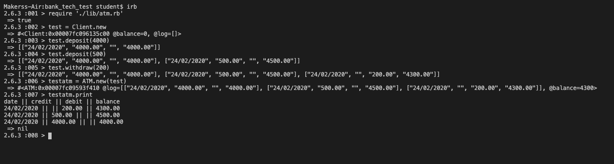

## Getting Started

<!-- PROJECT LOGO -->
                        _|   |_                     _|   |_
                        | ... |_._._._._._._._._._._| ... |
                        | ||| |  o NATIONAL BANK o  | ||| |
                        | """ |  """    """    """  | """ |
                    ())  |[-|-]| [-|-]  [-|-]  [-|-] |[-|-]|  ())
                  (())) |     |---------------------|     | (()))
                  (())())| """ |  """    """    """  | """ |(())())
                  (()))()|[-|-]|  :::   .-"-.   :::  |[-|-]|(()))()
                  ()))(()|     | |~|~|  |_|_|  |~|~| |     |()))(()
                    ||  |_____|_|_|_|__|_|_|__|_|_|_|_____|  ||
                  ~ ~^^ @@@@@@@@@@@@@@/=======\@@@@@@@@@@@@@@ ^^~ ~
                      ^~^~                                ~^~^
  <h3 align="center">THE ATM</h3>

  <p align="center">
    A program ran in IRB/PRY to print out a Clients balance
    <br />
    <a href="https://github.com/Walker-TW/Bank_Tech_Test"><strong>Explore the docs »</strong></a>
    <br />
    <br />
    <a href="https://github.com/Walker-TW/Bank_Tech_Test">View Demo</a>
    ·
    <a href="https://github.com/Walker-TW/Bank_Tech_Test/issues">Report Bug</a>
    ·
    <a href="https://github.com/Walker-TW/Bank_Tech_Test/issues">Request Feature</a>
  </p>
</p>
  

To get a local copy up and running follow these simple steps.

 <!-- TABLE OF CONTENTS -->
## Table of Contents

* [About the Project](#about-the-project)
* [Installation](#installation)
* [Usage](#usage)
* [License](#license)
* [Contact](#contact)
* [Specification](#specification)


<!-- ABOUT THE PROJECT -->
## About The Project




A project that creates a client who can deposit and withdraw money. The client can then using the (ATM class) call a print out to STDOUT of their statements.

The project has 100% test coverage.

### Installation
 
1. Clone the repo
```sh
git clone https://github.com/Walker-TW/Bank_Tech_Test
```
2. Install Gem dependencies
```sh
bundle install
```


<!-- USAGE EXAMPLES -->
## Usage

First navigate to the directory the files are kept in. Then enter IRB
```sh
irb
```
Then require the app file from the root
```sh
irb : 001 >require './lib/atm.rb'
```
Create a Client and then withdraw/deposit the money that you need
```sh
irb : 002 > x = Client.new
irb : 003 > x.deposit(300)
irb : 004 > x.withdraw(300)
```
Finally you can print out the statement by;
```sh
irb : 005 > x.print
To run tests please..
```sh
rspec
```
## License

Distributed under the MIT License. See `LICENSE` for more information.

  

## Specification

  
### Requirements


* You should be able to interact with your code via a REPL like IRB or the JavaScript console. (You don't need to implement a command line interface that takes input from STDIN.)

* Deposits, withdrawal.

* Account statement (date, amount, balance) printing.

* Data can be kept in memory (it doesn't need to be stored to a database or anything).

  

### Acceptance criteria

  

**Given** a client makes a deposit of 1000 on 10-01-2012

**And** a deposit of 2000 on 13-01-2012

**And** a withdrawal of 500 on 14-01-2012

**When** she prints her bank statement

**Then** she would see

  

```
date || credit || debit || balance
14/01/2012 || || 500.00 || 2500.00
13/01/2012 || 2000.00 || || 3000.00
10/01/2012 || 1000.00 || || 1000.00
```
